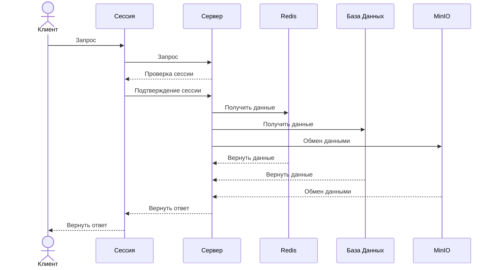

#Astral

```mermaid
sequenceDiagram
    actor Client as Клиент
    participant Session as Сессия
    participant Server as Сервер
    participant Redis as Redis
    participant BD as База Данных
    participant MinIO as MinIO

    Client->>Session: Запрос
    Session->>Server: Запрос
    Server-->>Session: Проверка сессии
    Session->>Server: Подтверждение сессии
    Server->>Redis: Получить данные
    Server->>BD: Получить данные
    Server->>MinIO: Обмен данными
    Redis-->>Server: Вернуть данные
    BD-->>Server: Вернуть данные
    MinIO-->>Server: Обмен данными
    Server-->>Session: Вернуть ответ
    Session-->>Client: Вернуть ответ
```
